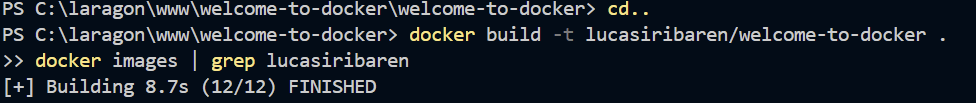
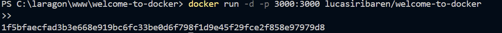
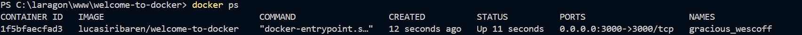
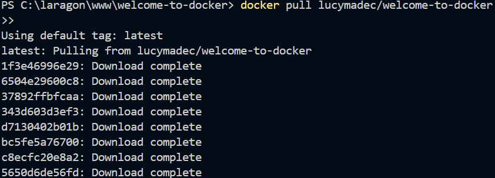
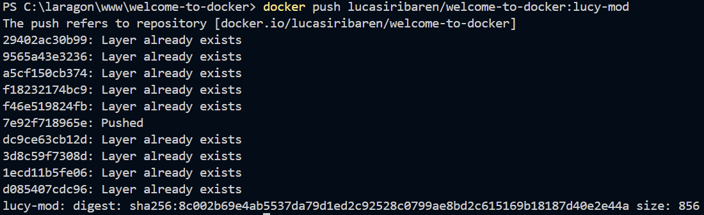

# Job 02 - Création et Modification d'Images Docker

## Étapes réalisées

### 1. Construction de l'image initiale
```bash
# Construire l'image
docker build -t lucasiribaren/welcome-to-docker .
```


### 2. Test de l'application
```bash
docker run -d -p 3000:3000 lucasiribaren/welcome-to-docker
docker ps
```



### 3. Modification de l'image d'une collègue
```bash
# Récupérer l'image
docker pull lucymadec/welcome-to-docker

# Construire la version modifiée
docker build -t lucasiribaren/welcome-to-docker:lucy-mod .
docker push lucasiribaren/welcome-to-docker:lucy-mod
```


