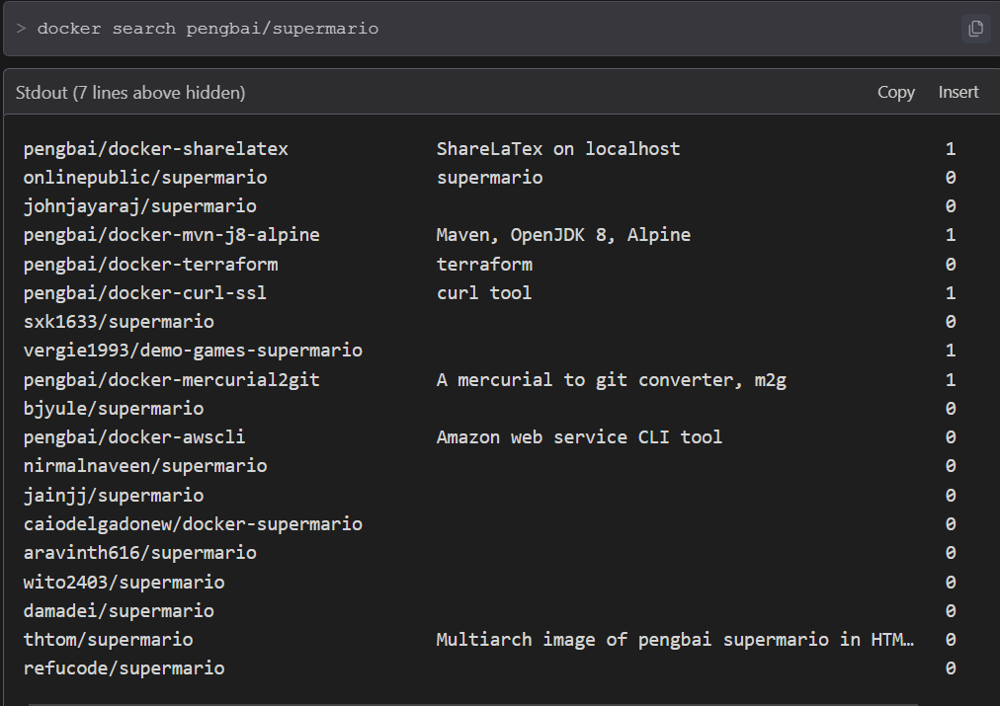
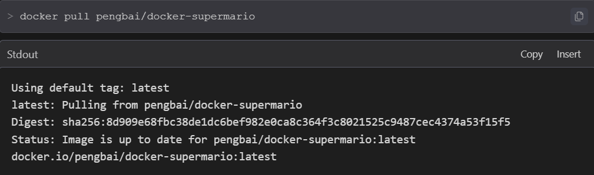
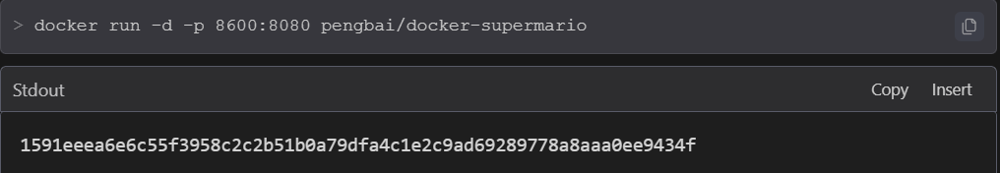
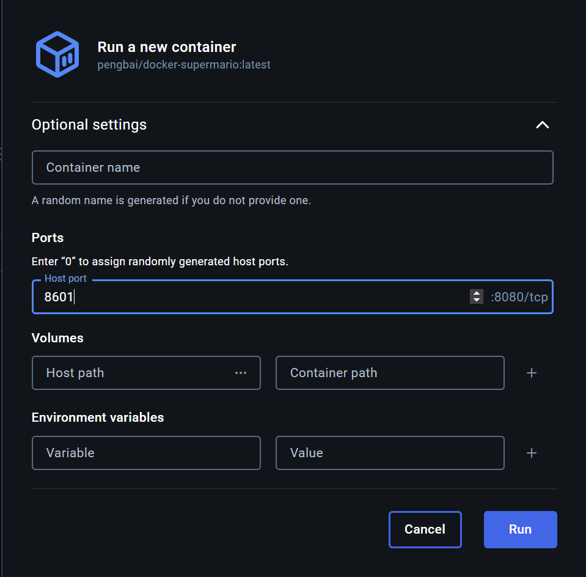
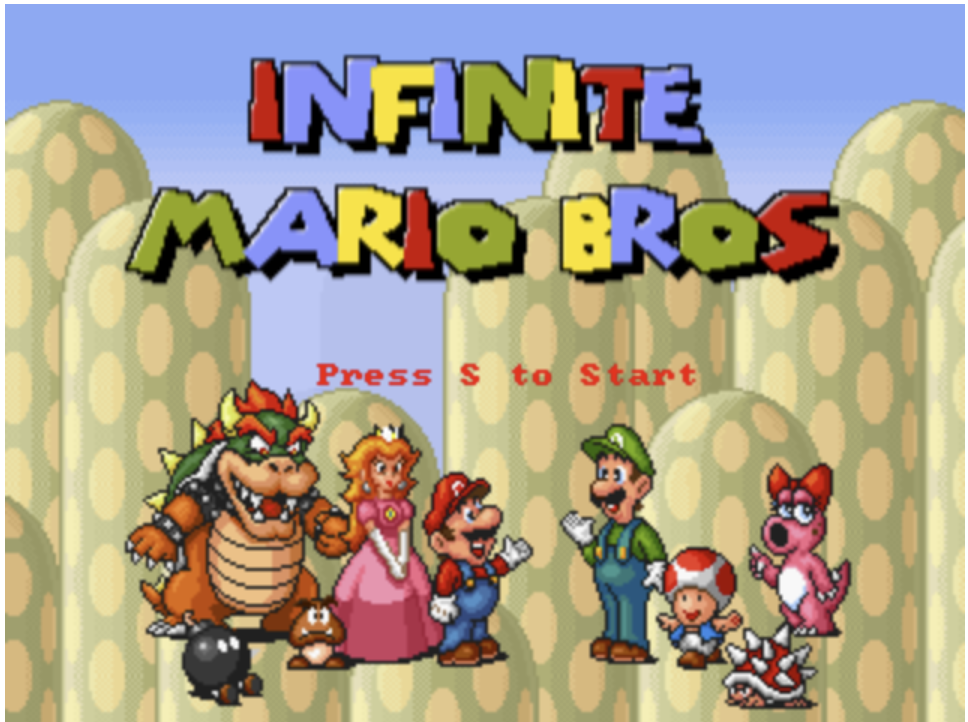
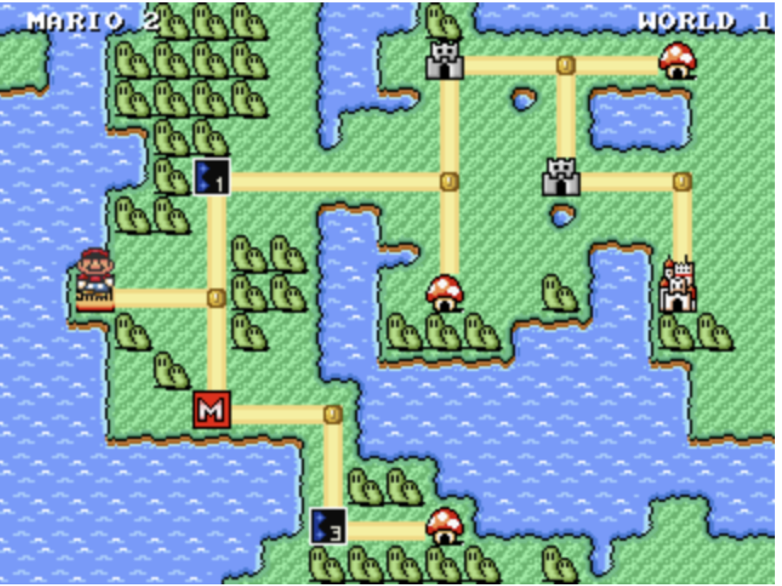
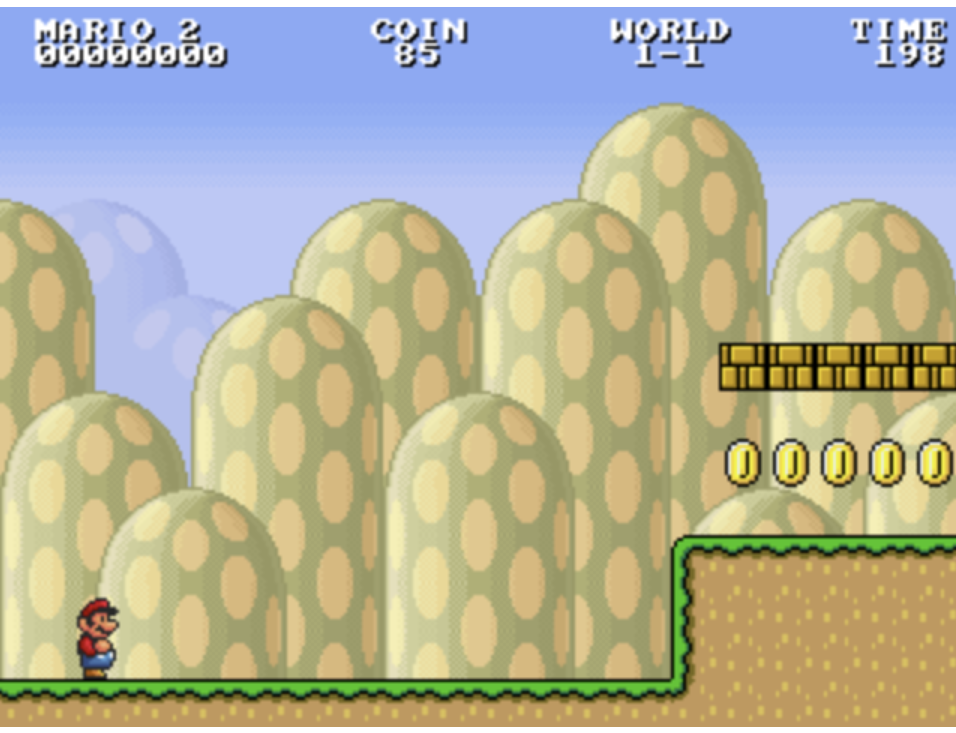
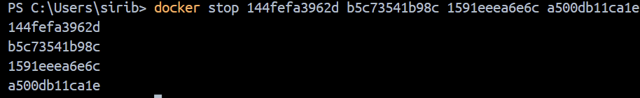
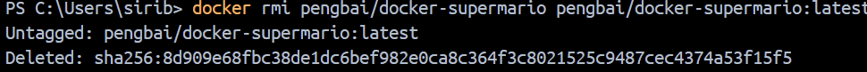

# Job 03 - Super Mario avec Docker

## Étapes réalisées

### 1. Recherche et installation de l'image
```bash
docker search pengbai/docker-supermario
docker pull pengbai/docker-supermario
```



### 2. Lancement des conteneurs
```bash
# Premier conteneur sur le port 8600
docker run -d -p 8600:8080 pengbai/docker-supermario

# Deuxième conteneur sur le port 8601
docker run -d -p 8601:8080 pengbai/docker-supermario
```



### 3. Le jeu en action




### 4. Arrêt et nettoyage
```bash
# Arrêt des conteneurs
docker stop <container_id>

# Suppression des conteneurs
docker rm <container_id>

# Suppression de l'image
docker rmi pengbai/docker-supermario
```


