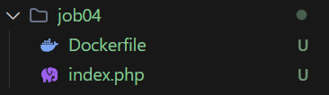
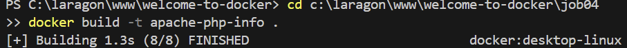
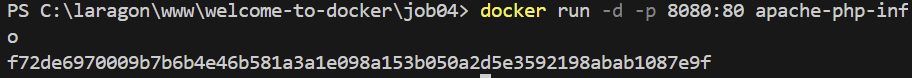
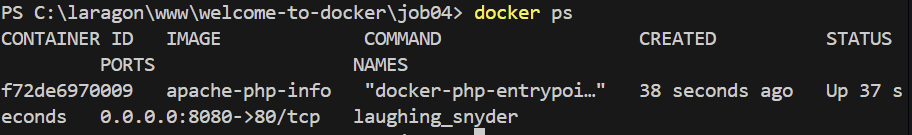
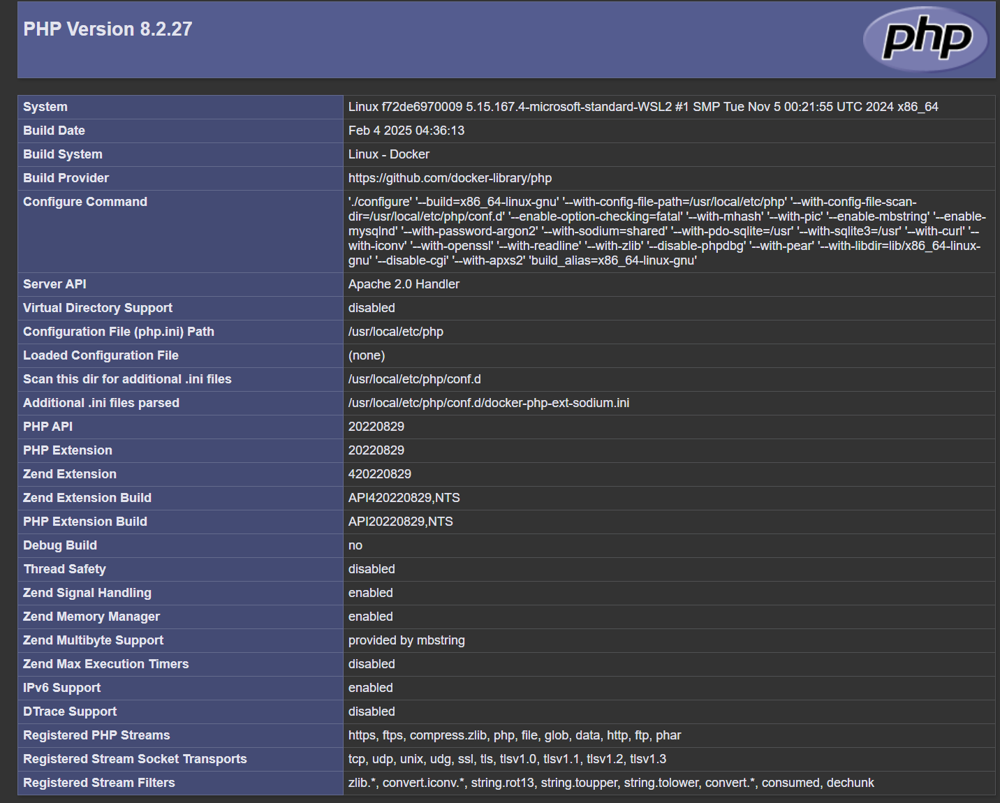
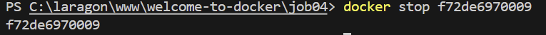

# Job 04 - Serveur Apache avec PHP Info

## Étapes réalisées

### 1. Création des fichiers
```bash
# Contenu de index.php
<?php phpinfo(); ?>

# Contenu du Dockerfile
FROM php:8.2-apache
COPY index.php /var/www/html/
EXPOSE 80
```


### 2. Construction de l'image
```bash
docker build -t apache-php-info ./job04
```


### 3. Lancement du conteneur
```bash
docker run -d -p 8080:80 apache-php-info
```


### 4. Vérification du serveur
```bash
docker ps
```



### 5. Arrêt du conteneur
```bash
docker stop <container_id>
```

