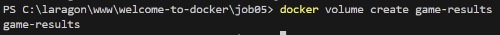
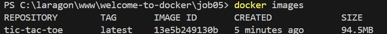

# Job 05 - Tic Tac Toe avec Docker et Volumes

Ce projet consiste à créer une application web de Tic Tac Toe (Morpion) utilisant Docker avec un volume pour sauvegarder les résultats des parties.

## Objectifs
- Configurer un projet Docker pour une application web
- Utiliser Nginx comme serveur web
- Implémenter la persistance des données avec un volume Docker
- Rendre le jeu accessible via un navigateur sur le port 8080

## Étapes réalisées

### 1. Création des fichiers nécessaires
```bash
# Structure du projet
- index.html    # Interface du jeu
- save.php      # Script de sauvegarde des résultats
- results.json  # Fichier de stockage des résultats
- Dockerfile    # Configuration de l'image Docker
- nginx.conf    # Configuration du serveur Nginx
```


### 2. Création du volume Docker
```bash
# Création d'un volume nommé "game-results"
docker volume create game-results
```


### 3. Construction de l'image Docker
```bash
# Construction de l'image
docker build -t tic-tac-toe .
```


### 4. Vérification de l'image créée
```bash
# Liste des images
docker images | findstr tic-tac-toe
```


### 5. Lancement du conteneur
```bash
# Lancement avec mapping du port 8080 et montage du volume
docker run -d -p 8080:80 -v game-results:/usr/share/nginx/html/results --name tictactoe tic-tac-toe
```


### 6. Vérification du conteneur
```bash
# Liste des conteneurs actifs
docker ps | findstr tictactoe
```


### 7. Le jeu en action
- Accès au jeu via : http://localhost:8080
- Interface du jeu permettant de jouer au Tic Tac Toe
- Sauvegarde automatique des résultats


### 8. Vérification des résultats
```bash
# Affichage du contenu du fichier results.json
docker exec tictactoe cat /usr/share/nginx/html/results/results.json
```


### 9. Inspection du volume
```bash
# Inspection détaillée du volume
docker volume inspect game-results
```


### 10. Arrêt et nettoyage
```bash
# Arrêt du conteneur
docker stop tictactoe

# Suppression du conteneur
docker rm tictactoe
```


