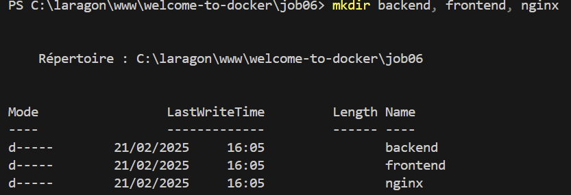
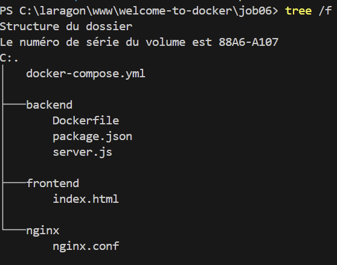
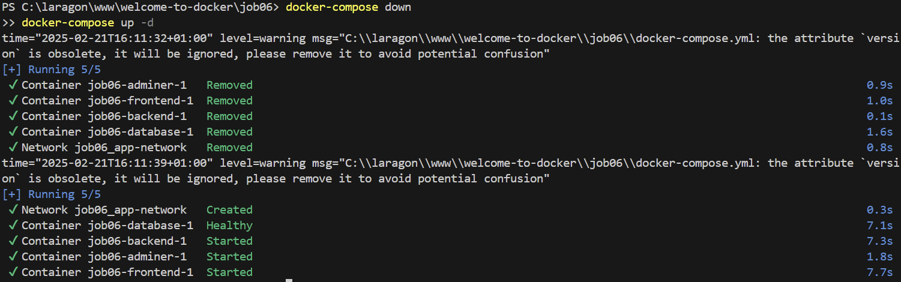
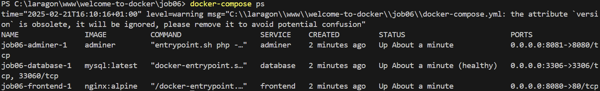
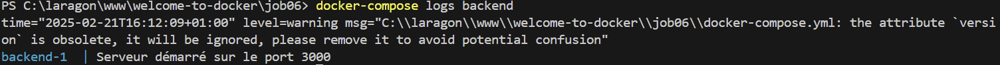
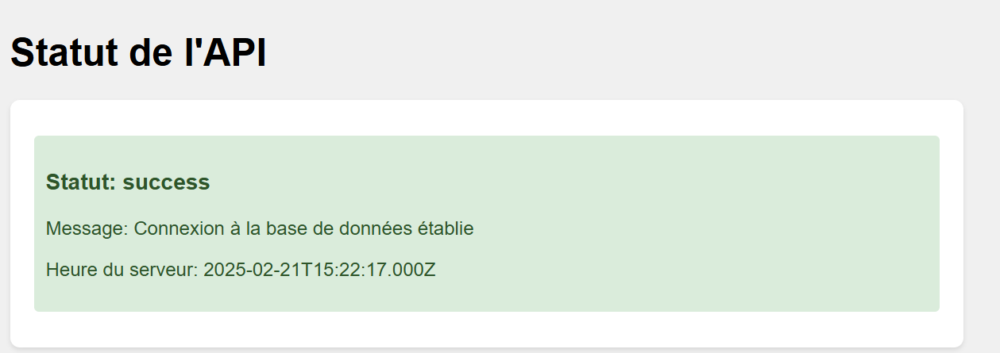
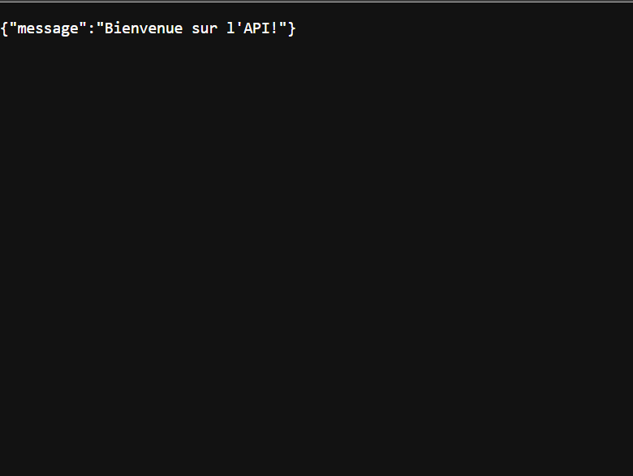
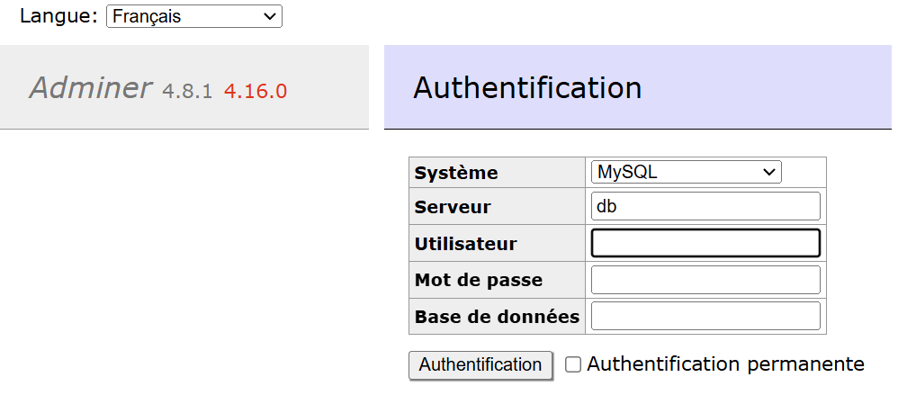
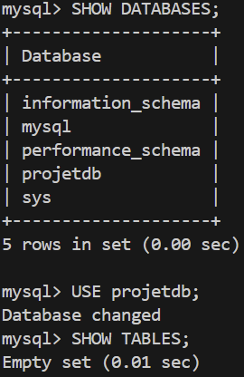
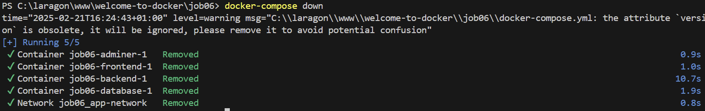

# Job 06 - Application Multi-conteneurs avec Docker Compose

Ce projet consiste à créer une application web multi-conteneurs utilisant Docker Compose, comprenant un frontend, un backend Node.js, une base de données MySQL et un outil d'administration Adminer.

## Étapes de réalisation

### 1. Création de la structure du projet
```bash
mkdir job06
cd job06
mkdir backend frontend nginx
```


### 2. Création des fichiers de configuration
Les fichiers suivants ont été créés :
- docker-compose.yml : Configuration des services
- backend/server.js : API Node.js
- backend/package.json : Dépendances Node.js
- backend/Dockerfile : Configuration du conteneur Node.js
- frontend/index.html : Interface utilisateur
- nginx/nginx.conf : Configuration du serveur web



### 3. Lancement des services
```bash
docker-compose up -d
```


### 4. Vérification des services
```bash
docker-compose ps
```


### 5. Vérification des logs du backend
```bash
docker-compose logs backend
```


### 6. Accès aux services
- Frontend : http://localhost:8080


- Backend : http://localhost:3000


- Adminer : http://localhost:8081
  - Serveur : database
  - Utilisateur : root
  - Mot de passe : root
  - Base de données : projetdb


### 7. Accès à MySQL en ligne de commande
```bash
docker exec -it job06-database-1 mysql -uroot -proot projetdb
```


### 8. Arrêt des services
```bash
docker-compose down
```

