# **Docker - Guide des Commandes de Base**

Ce guide couvre les commandes essentielles pour utiliser Docker, avec des exemples et des captures d'écran pour chaque étape.

---

## **1. Vérifier la version de Docker**  
```bash
docker --version
```
- Permet de vérifier la version installée de Docker.  
- **Capture d'écran :**  
  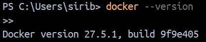

---

## **2. Tester les commandes de base**  
```bash
docker info
docker ps
docker images
docker run test
docker stop <nom_ou_id_du_container>
```
- `docker info` : Affiche les infos système Docker.  
- `docker ps` : Liste les conteneurs actifs.  
- `docker images` : Affiche les images locales.  
- `docker run` : Lance un conteneur.  
- `docker stop` : Arrête un conteneur.  

- **Captures d'écran :**  
  - 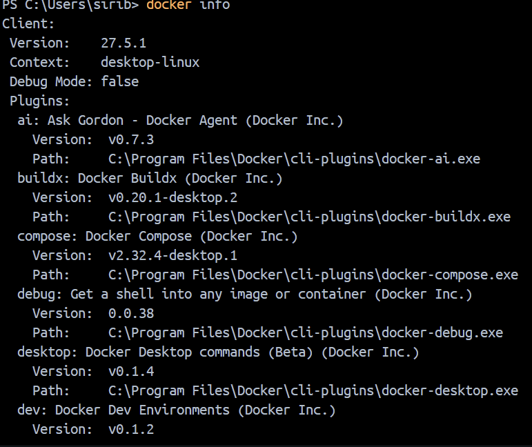  
  - 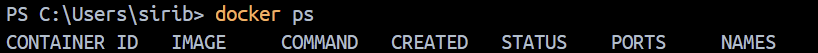  
  - 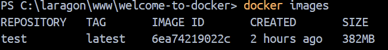  
  - 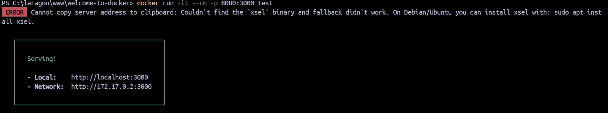  
  - 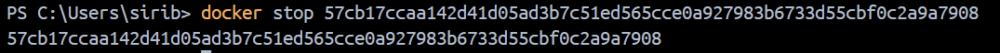  

---

## **3. Récupérer une image Docker**  
```bash
docker pull nginx
docker images
```
- Télécharge l'image **nginx** depuis Docker Hub.  
- Vérifie ensuite que l'image est bien téléchargée.  
- **Captures d'écran :**  
  - 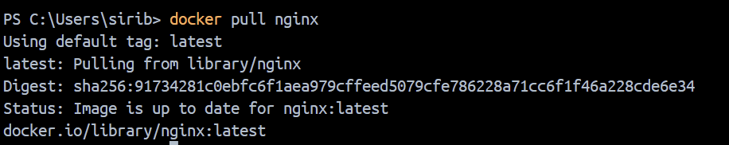  
  - 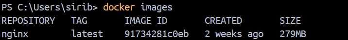  

---

## **4. Construire un conteneur Docker**  
```bash
docker run -it --rm -p 8080:80 nginx
```
- Remplacez `8080` par un port disponible sur votre machine.  
- Accessible sur : [http://localhost:8080](http://localhost:8080)  
- **Capture d'écran :**  
  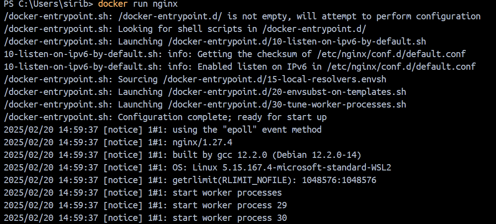  

- Relancez les commandes de base pour vérifier l'état du conteneur :  
```bash
docker ps
docker images
```  
- **Captures d'écran :**  
  - 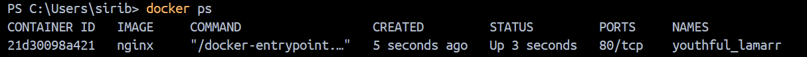  
  - 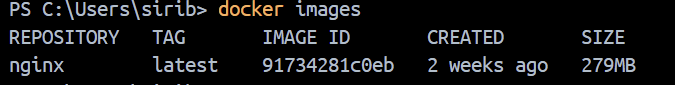  

---

## **5. Arrêter le conteneur**  
```bash
docker stop <nom_ou_id_du_container>
```
- Arrête le conteneur en cours d'exécution.  
- **Capture d'écran :**  
  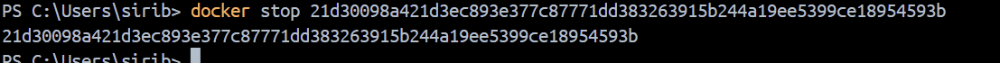  

---

## **6. Supprimer le conteneur**  
```bash
docker rm <nom_ou_id_du_container>
```
- Supprime le conteneur arrêté.  
- **Capture d'écran :**  
  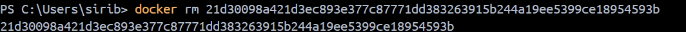  

---

## **7. Supprimer l'image Docker**  
```bash
docker rmi nginx
```
- Supprime l'image **nginx** du système local.  
- **Capture d'écran :**  
  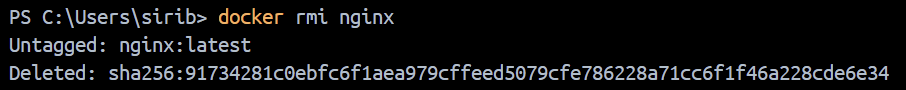

---

## **8. Exemples de suppression avancée**  

- **Un conteneur spécifique**  
  ```bash
  docker rm <nom_ou_id_du_container>
  ```

- **Plusieurs conteneurs**  
  ```bash
  docker rm conteneur1 conteneur2 conteneur3
  ```

- **Tous les conteneurs arrêtés**  
  ```bash
  docker container prune
  ```

- **Forcer la suppression d'un conteneur actif**  
  ```bash
  docker rm -f <nom_ou_id_du_container>
  ```

- **Une image spécifique**  
  ```bash
  docker rmi <nom_de_l_image>
  ```

- **Plusieurs images**  
  ```bash
  docker rmi image1 image2 image3
  ```

- **Toutes les images inutilisées**  
  ```bash
  docker image prune
  ```

- **Toutes les images non utilisées**  
  ```bash
  docker image prune -a
  ```

- **Forcer la suppression d'une image**  
  ```bash
  docker rmi -f <nom_de_l_image>
  ```

---

## **9. Correction d'erreur courante**  
- Attention aux mauvais ports dans les commandes `docker run`.  
- Exemple d'erreur : 
  ```bash
  docker run -p 8080:80 nom_image
  ```
  Alors que l'application tourne sur le **port 3000**.  
- **Correction :**  
  ```bash
  docker run -p 8080:3000 nom_image
  ```

---

## **10. Conclusion**  
Ce guide couvre les bases de Docker pour gérer les **conteneurs** et **images**.  
Les commandes sont simples et accompagnées de captures d'écran pour bien visualiser chaque étape.  

---
